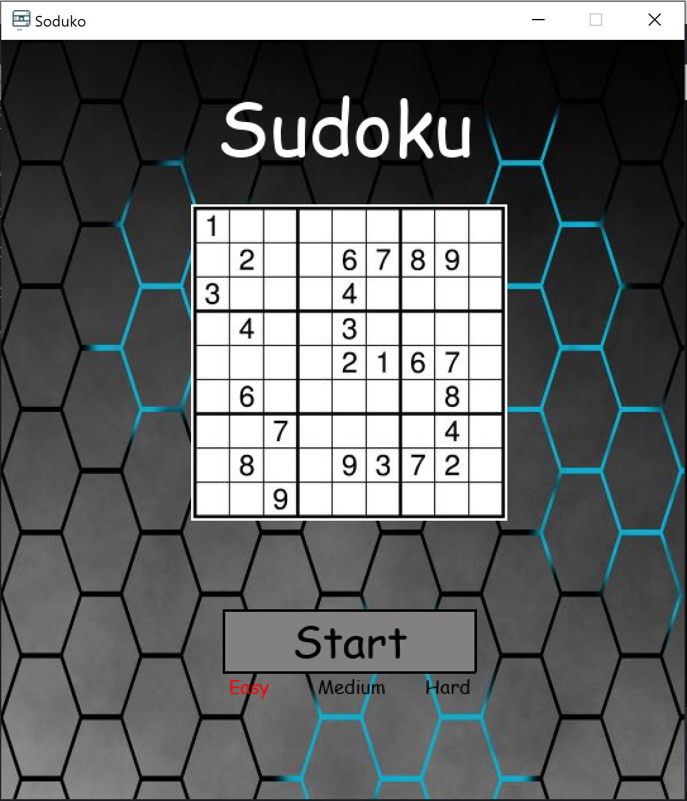

# Sudoku
Sudoku game/solver

This is a python program that is used to solve a Sudoku puzzle through recursion and backtracking.  There is a user interface(created with Pygame) that allows the user to play a Sudoku game and input the answer manually.  Once the user is finsihed it will check the players solution with the one it calculated to see if the player is correct.  The player can also just click the "a" key and the program will generate the answer for them.  

To run this application all you need to do is install the pygame library and python to your computer.  Once this is done all you have to do is open the app.
